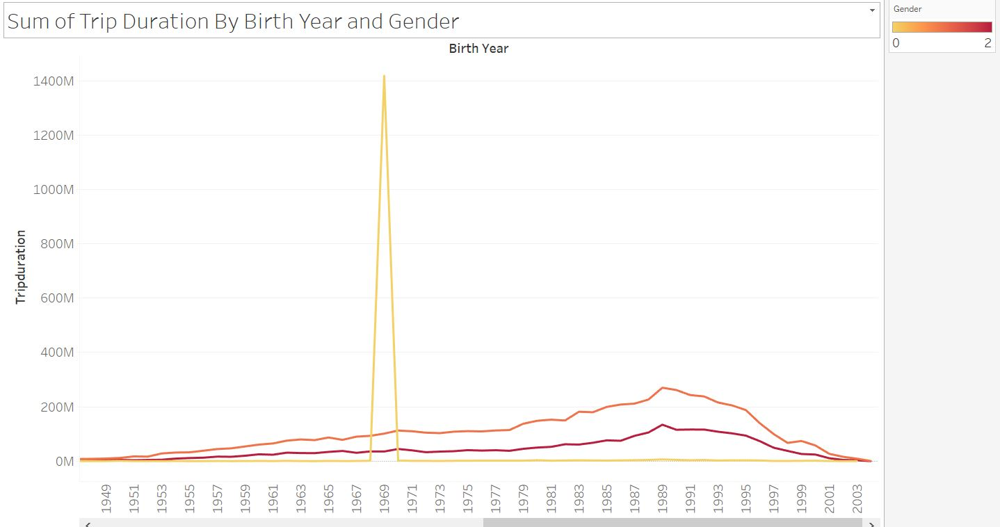
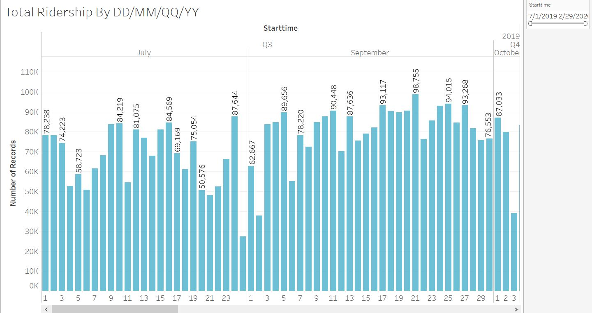
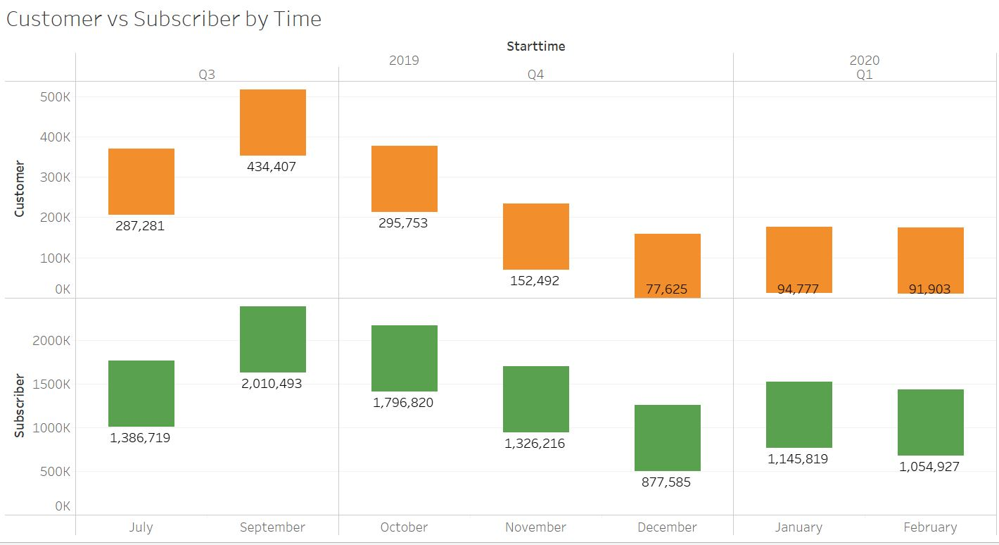
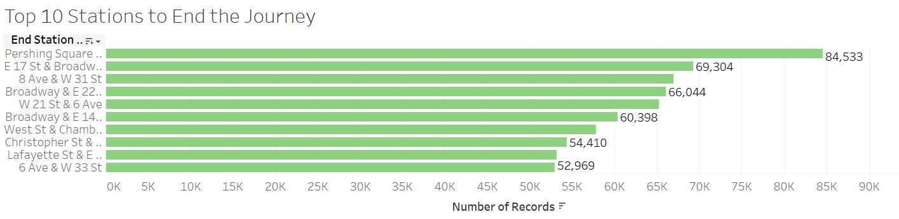
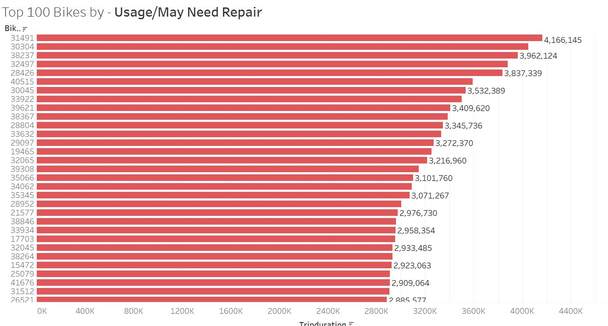
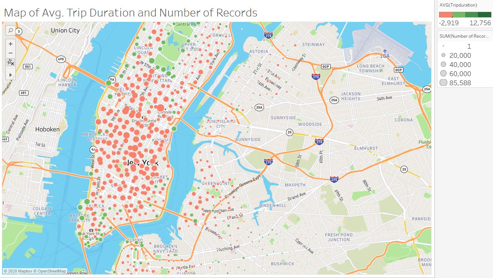
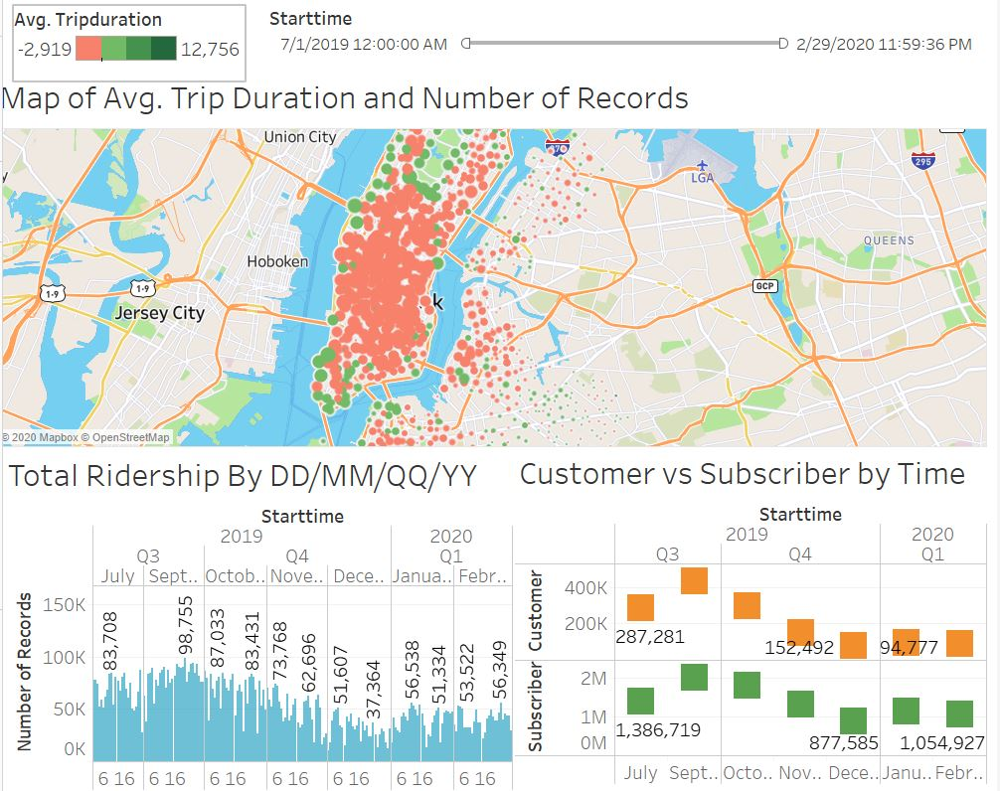
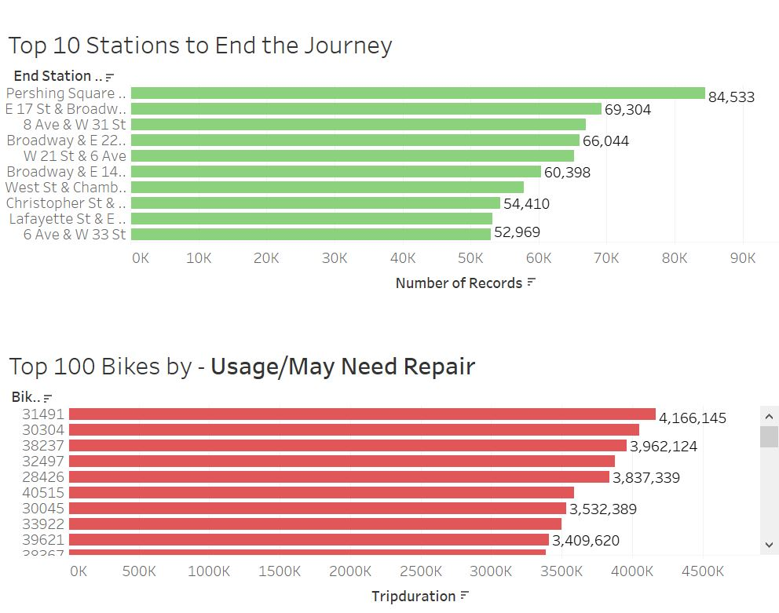

# Tableau - Citi Bike Analytics

#### Project Link: https://public.tableau.com/profile/bhargav6508#!/vizhome/Citi_Bike_15911516156260/Dashboard1

## Technology: Tableau Desktop, Tableau Public, Microsoft SQL Server, Excel

#### Data Source: 
Data was downloaded as CSV files from citi bike website for Ney York City.
NYC: https://www.citibikenyc.com/system-data

#### Created a Database and Table
Created a Data base and a table in MS SQ Server:

```sql
CREATE TABLE CityBikeData(
	BIKEID INT,
	TRIPDURATION INT,	
	STARTTIME DATETIME,
	STOPTIME DATETIME,
	START_STATION_ID INT,
	START_STATION_NAME VARCHAR(255),
	START_STATION_LATITUDE Decimal(9,6),
	START_STATION_LONGITUDE Decimal(9,6),
	END_STATION_ID INT,
	END_STATION_NAME VARCHAR(255),
	END_STATION_LATITUDE Decimal(9,6),
	END_STATION_LONGITUDE Decimal(9,6),
	USERTYPE VARCHAR(255),
	BIRTH_YEAR INT, 
	GENDER INT);
  ```

#### Import Data
Imported CSV files with monthly data as flat files into multiple Tables.

#### Merge all Data in CityBikeData Table
Merged all the data from monthly table data into CityBike Data Table.

```sql
Insert into dbo.citybikedata (
       [BIKEID]
      ,[TRIPDURATION]
      ,[STARTTIME]
      ,[STOPTIME]
      ,[START_STATION_ID]
      ,[START_STATION_NAME]
      ,[START_STATION_LATITUDE]
      ,[START_STATION_LONGITUDE]
      ,[END_STATION_ID]
      ,[END_STATION_NAME]
      ,[END_STATION_LATITUDE]
      ,[END_STATION_LONGITUDE]
      ,[USERTYPE]
      ,[BIRTH_YEAR]
      ,[GENDER])

Select 
       [_bikeid_]
      ,[_tripduration_]
      ,[_starttime_]
      ,[_stoptime_]
      ,[_start_station_id_]
      ,[_start_station_name_]
      ,[_start_station_latitude_]
      ,[_start_station_longitude_]
      ,[_end_station_id_]
      ,[_end_station_name_]
      ,[_end_station_latitude_]
      ,[_end_station_longitude_]
      ,[_usertype_]
      ,[_birth_year_]
      ,[_gender_]
from [dbo].[201907-citibike-tripdata]
```
#### Connecting DB Server to Tableau Desktop
Connected Tableau Desktop to SSMS Server to establish live connection.

#### Analysis

1. Count of Male Riders was higher than riders who belonged to Female and Unkown gender.  
** Notice in the screenshot one of the ride lasted for 390+ hours. This is most likely an error in data.



2. Ridership was higher in Warmer months compared to colder months.



3. Customer vs Subscriber
Count of Subscribers was higher than Customers. Also, both the counts are higher in warmer months than colder months.



4. Most popular Destinations for Riders were closer to Transit stations or Tourist Attractions.



5. Chart of Top 100 Bikes by Usage. They might also be most likely needing repairs or maintenance.



6. Map
As per the map, average trip duration was higher  near Financial District in Lower Manhattan, Hudson Yards & Central Park in Upper Manhattan as well as parts of Brooklyn near Brooklyn Bridge.



7. Dashboard#1



8. Dashboard#2



